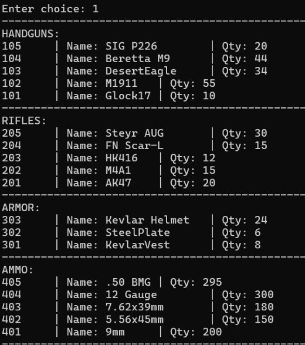
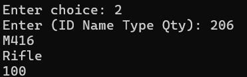
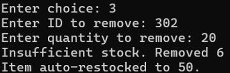
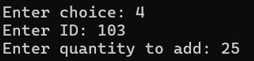
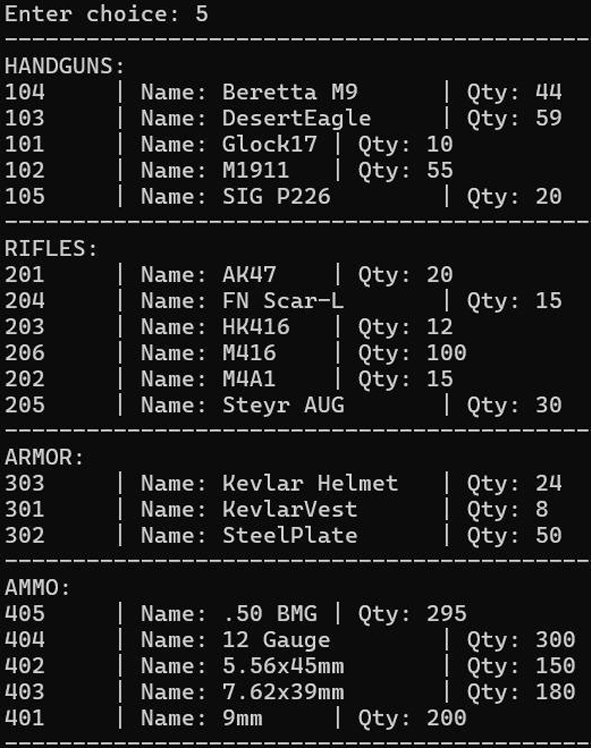
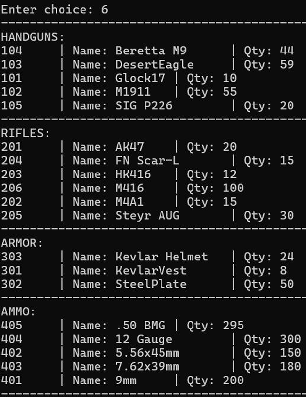
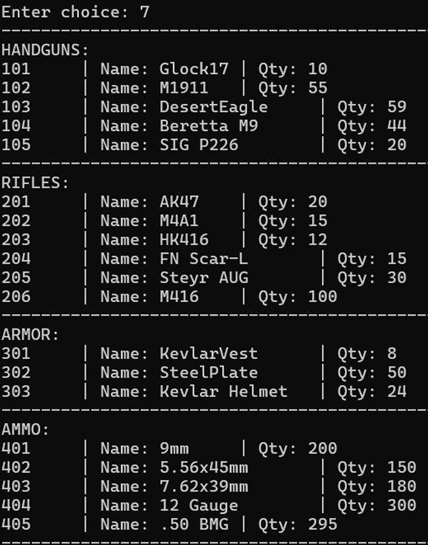
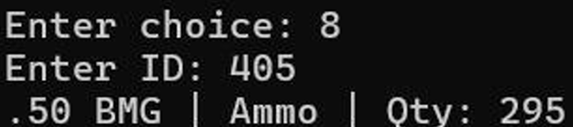
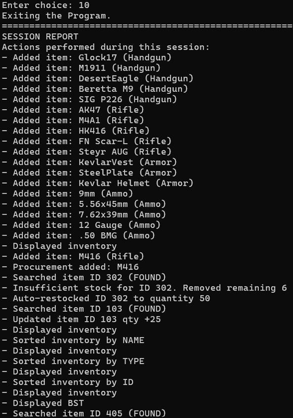

# Weapon & Ammunition Management System

A console-based Inventory Management System implemented in C++ using fundamental Data Structures and Algorithms (DSA).

This project manages different categories of items such as handguns, rifles, armor, and ammunition. It demonstrates practical applications of Linked Lists, Recursion, Sorting Algorithms, and Binary Search Trees (BST) in a real-world inventory system.

---

## 1. Abstract

This project presents a Weapon & Ammunition Management System implemented using C++ and core Data Structures concepts. The system supports adding new items, updating quantities, searching items using recursion, sorting inventory using linked lists, and organizing item IDs using a Binary Search Tree (BST).

A logging mechanism records all actions performed during a session and generates a final report upon exit. The project demonstrates the real-world application of DSA concepts in inventory management systems.

---

## 2. Introduction

Inventory management is a critical component in systems such as warehouses, military storage, and retail stores. Efficient inventory handling requires structured storage, fast searching, and organized data representation.

This system uses dynamic memory allocation and structured data organization to perform efficient operations through a menu-driven console interface.

---

## 3. Objectives

- Design an inventory management system using C++
- Implement dynamic inventory storage using linked lists
- Apply recursion for searching operations
- Implement sorting algorithms on linked list data
- Use Binary Search Tree (BST) for structured ID storage
- Generate a session activity report
- Demonstrate practical implementation of DSA concepts

---

## 4. Scope of the Project

### Included Features

- Add new inventory items
- Remove items
- Update item quantities
- Search items by ID
- Sort inventory by name, type, and ID
- Display inventory by categories
- Display Binary Search Tree (BST)
- Generate session activity report upon exit

---

## 5. Data Structures Used

### 5.1 Singly Linked List

Used for:
- Inventory storage
- Logging system

Advantages:
- Dynamic memory allocation
- No fixed size limitation
- Efficient insertions

---

### 5.2 Recursion

Used for:
- Searching items in inventory
- BST insertion
- BST inorder traversal

Benefits:
- Cleaner implementation
- Natural traversal of tree structures

---

### 5.3 Binary Search Tree (BST)

Used to:
- Store item IDs
- Display IDs in sorted order

Operations Implemented:
- Insert
- Inorder traversal

Time Complexity (Average Case):
- Insertion: O(log n)
- Traversal: O(n)

---

### 5.4 Sorting Algorithm

A bubble-sort-like approach is implemented on linked list data to sort:

- By Item Name
- By Item Type (custom ranking)
- By Item ID

Time Complexity: O(n²)

---

## 6. System Design

### 6.1 Classes and Structures

- `Item` – Represents an inventory item  
- `Inventory` – Manages inventory operations  
- `Procurement` – Handles item addition and updates  
- `Log` – Stores session activity logs  
- `BST` – Manages Binary Search Tree operations  

---

### 6.2 Menu-Driven Design

The system runs using a menu-driven interface. The user selects options to perform specific operations. The program continues execution until the Exit option is selected.

---

## 7. Functional Description

### Menu Options

1. Display Inventory  
2. Add New Item  
3. Remove Item  
4. Update Item  
5. Sort Inventory by Name  
6. Sort Inventory by Type  
7. Sort Inventory by ID  
8. Search Item by ID  
9. Display Binary Search Tree  
10. Exit and Generate Session Report  

Each action is logged in the session log system.

---

## 8. Time Complexity Analysis

| Operation | Time Complexity |
|------------|-----------------|
| Add Item | O(1) |
| Search Item (Linked List) | O(n) |
| Sort Inventory | O(n²) |
| BST Insertion | O(log n) (Average) |
| BST Traversal | O(n) |

---

Upload the screenshots from your project report into the `images` folder using the same names (or adjust names in README accordingly).

---

### Display Inventory

---

### Add New Item

---

### Remove Item

---

### Update Item

---

### Sort by Name

---

### Sort by Type

---

### Sort by ID

---

### Search Item

---

### BST Display

---

### Session Report

---

## 10. Technologies Used

- C++
- Object-Oriented Programming
- Linked Lists
- Recursion
- Binary Search Tree
- Sorting Algorithms
- Console-based interface

---

